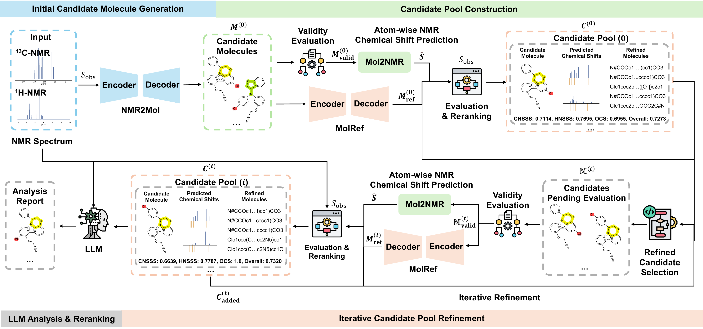

# NMR-RISE

**Reasoning and Iterative Structure Elucidation from NMR Spectroscopy**

[](https://huggingface.co/Napister/NMR-RISE)
[](https://www.python.org/)

NMR-RISE is a modular framework for elucidating small-molecule structures from molecular formulae and one-dimensional ¹H/¹³C NMR spectra. Instead of treating structure elucidation as a single black-box prediction, NMR-RISE mirrors an expert's iterative workflow: propose candidates, predict their spectra, refine inconsistent structures, rerank them with complementary metrics, and optionally produce an evidence-grounded report with a large language model (LLM).

The framework combines four components:

- **NMR2Mol** generates candidate SMILES from the molecular formula and NMR spectra.
- **Mol2NMR** predicts atom-resolved ¹H and ¹³C chemical shifts for spectral validation.
- **MolRef** proposes improved structures conditioned on the observed spectra and an existing candidate.
- **LLM reranking** analyzes the spectra, structures, predicted shifts, and model scores to explain and refine the final ranking.



## Highlights

- Iterative candidate generation, validation, and refinement rather than one-shot decoding.
- Multi-metric ranking with an NMR Spectra Similarity Score (NSSS) and Optimization Completeness Score (OCS).
- Support for ¹³C-only, ¹H-only, and combined inputs.
- Training and evaluation on simulated **USPTO-NMR** and experimental **NMRBank** and **NMRexp** spectra.
- Optional LLM-based, evidence-grounded reranking and explanation.
- Published checkpoints, datasets, benchmark subsets, and intermediate results on [Hugging Face](https://huggingface.co/Napister/NMR-RISE).

### Reported results

The following table illustrates the framework performance for combined ¹³C+¹H input without LLM integration:

| Dataset | Top-1 | Top-5 | Top-10 | Tani@1 | Tani@5 | Tani@10 |
|---|---:|---:|---:|---:|---:|---:|
| USPTO-NMR | 78.07 | 90.56 | 91.73 | 93.60 | 96.12 | 96.49 |
| NMRBank | 58.75 | 69.09 | 70.69 | 75.73 | 79.46 | 80.37 |
| NMRexp | 64.23 | 81.23 | 83.16 | 89.11 | 92.12 | 92.79 |

## Repository layout

```text
NMR-RISE-code/
├── src/nmr_rise/
│   ├── nmr2mol/              # NMR2Mol and MolRef models
│   ├── mol2nmr/              # SE(3)-equivariant Mol2NMR model
│   └── utils/                # End-to-end NMR-RISE and LLM utilities
├── scripts/
│   ├── nmr2mol/              # NMR2Mol/MolRef training configs
│   ├── mol2nmr/              # Mol2NMR data processing and training
│   └── evaluation/           # Main and ablation experiments
├── notebooks/
│   ├── data_process/         # Dataset construction
│   └── result_analysis/      # Evaluation result analysis
├── prompt/                   # Prompt templates
├── data/                     # Downloaded datasets
├── runs/                     # Checkpoints and training outputs
└── results/                  # Evaluation outputs
```

## Installation

The complete pipeline is intended for **Linux x86-64**, **Python 3.10**, and an NVIDIA GPU. The bundled Uni-Core wheel is specifically built for CPython 3.10 on Linux x86-64 and is labeled for CUDA 11.8/PyTorch 2.0. 

Install [uv](https://docs.astral.sh/uv/), then run from the repository root:

```bash
uv venv --python 3.10
source .venv/bin/activate
uv pip install -e .
```

For checkpoint downloads, install the Hugging Face CLI in the same environment:

```bash
uv pip install -U huggingface_hub
```

## Data and checkpoints

All published artifacts are hosted at [Napister/NMR-RISE](https://huggingface.co/Napister/NMR-RISE). The repository is large: the logical file sizes are approximately 4.4 GB for `data/`, 64.3 GB for `runs/`, and 41.5 GB for `results/`. Prefer selective downloads unless you need every training log and intermediate result.

### Minimal download for inference or evaluation

Choose one of `NMRExp`, `NMRBank`, or `USPTO-NMR`:

```bash
DATASET=NMRExp

hf download Napister/NMR-RISE \
  --repo-type model \
  --include "data/evaluation/${DATASET}-10000/**" \
  --include "data/nmrshiftdb2_2024/**" \
  --include "runs/nmr2mol/${DATASET}/multitask_nmr2mol/preprocessor.pkl" \
  --include "runs/nmr2mol/${DATASET}/multitask_nmr2mol/version_0/checkpoints/best.ckpt" \
  --include "runs/nmr2mol/${DATASET}/multitask_molref_10/preprocessor.pkl" \
  --include "runs/nmr2mol/${DATASET}/multitask_molref_10/version_0/checkpoints/best.ckpt" \
  --include "runs/mol2nmr/${DATASET}/full_cc_pred_rmse_4/checkpoint_best.pt" \
  --include "runs/mol2nmr/${DATASET}/full_cc_pred_rmse_4/target_scaler.ss" \
  --local-dir .
```

The published evaluation subsets live under `data/evaluation/`, while the evaluation scripts expect them inside each dataset directory. Create the expected link once:

```bash
mkdir -p "data/${DATASET}"
ln -sfn "../evaluation/${DATASET}-10000" "data/${DATASET}/${DATASET}-10000"
```

For the 1,000-sample calibration experiments, download and link `${DATASET}-1000` in the same way.

### Training datasets

Download the full processed splits for a selected dataset:

```bash
DATASET=NMRExp
hf download Napister/NMR-RISE \
  --repo-type model \
  --include "data/${DATASET}/full/**" \
  --local-dir .
```

Dataset statistics:

| Dataset | Type | Total | Train | Validation | Test |
|---|---|---:|---:|---:|---:|
| USPTO-NMR | simulated | 794,403 | 635,522 | 79,440 | 79,441 |
| NMRBank | experimental | 121,795 | 97,436 | 12,179 | 12,180 |
| NMRexp | experimental | 1,229,679 | 983,743 | 122,968 | 122,968 |


### Full artifact snapshot

Only use this when you need every dataset, checkpoint, log, and intermediate result:

```bash
hf download Napister/NMR-RISE --repo-type model --local-dir .
```

## Usage

### Input format

Each sample is a Python dictionary. A minimal combined-modality example is:

```python
sample = {
    "molecular_formula": "C2H6O",
    "h_nmr_peaks": [
        {
            "delta": 1.20,
            "rangeMin": 1.15,
            "rangeMax": 1.25,
            "category": "t",
            "nH": 3,
            "j_values": "7.0",
        },
        {
            "delta": 3.65,
            "rangeMin": 3.60,
            "rangeMax": 3.70,
            "category": "q",
            "nH": 2,
            "j_values": "7.0",
        },
        {
            "delta": 2.10,
            "rangeMin": 2.00,
            "rangeMax": 2.20,
            "category": "s",
            "nH": 1,
            "j_values": None,
        },
    ],
    "c_nmr_peaks": [
        {"delta (ppm)": 18.3},
        {"delta (ppm)": 58.1},
    ],
}
```

Use `None` for an unavailable modality. For example, set `h_nmr_peaks=None` for ¹³C-only inference.

### End-to-end inference

```python
from datasets import Dataset
from nmr_rise.utils.nmr_rise import NMR_RISE, NMR_RISE_Config

dataset_name = "NMRExp"

config = NMR_RISE_Config()
config.nmr2mol_config["model"]["model_checkpoint_path"] = (
    f"runs/nmr2mol/{dataset_name}/multitask_nmr2mol/version_0/checkpoints/best.ckpt"
)
config.nmr2mol_config["preprocessor_path"] = (
    f"runs/nmr2mol/{dataset_name}/multitask_nmr2mol/preprocessor.pkl"
)
config.molref_config["model"]["model_checkpoint_path"] = (
    f"runs/nmr2mol/{dataset_name}/multitask_molref_10/version_0/checkpoints/best.ckpt"
)
config.molref_config["preprocessor_path"] = (
    f"runs/nmr2mol/{dataset_name}/multitask_molref_10/preprocessor.pkl"
)
config.mol2nmr_config["save_dir"] = (
    f"runs/mol2nmr/{dataset_name}/full_cc_pred_rmse_4"
)

model = NMR_RISE(config)
input_dataset = Dataset.from_list([sample])

result = model.infer_dataset(
    dataset=input_dataset,
    beam_size=10,
    top_k=10,
    refinement_iters=5,
    rerank_nmr_metric="rmse",
    rerank_metric_ratio=(0.6, 0.3, 0.1),
    show_progress=True,
    enable_dataset_progress=True,
)

print(result[0]["candidates"])
result.save_to_disk("results/my_inference")
```

The main output fields are `pred_smiles`, `pred_scores`, `candidates`, and `candidates_info_<iteration>`. Each candidate includes its SMILES, predicted atom-level shifts, NSSS components, OCS (`molref_score`), origin, and refinement history.

### Optional LLM reranking

See [notebooks/llm_rerank/example.ipynb](notebooks/llm_rerank/example.ipynb) for a complete example that continues from the `result` dataset above. The notebook shows how to prepare the prompt and candidate PDF, then compares Perplexity reranking without few-shot examples and with examples from the manually curated 50-case pool in `data/NMRExp/LLM_Rerank/50`.

### Recommended scoring settings

The manuscript selected normalized RMSE as NSSS and the following weights on the calibration sets:

| Input | `modality_to_drop` | `rerank_metric_ratio` | Meaning |
|---|---|---|---|
| ¹³C+¹H | `None` | `(0.6, 0.3, 0.1)` | CNSSS, HNSSS, OCS |
| ¹³C only | `"Multiplets"` | `(0.8, 0.2)` | CNSSS, OCS |
| ¹H only | `"Carbon"` | `(0.6, 0.4)` | HNSSS, OCS |

`rmse` and `set_match_score` are implemented. The largest gain generally occurs in the first refinement round; five rounds reproduce the main experimental setup.

## Model training and paper reproduction

Detailed instructions for training NMR2Mol, MolRef, and Mol2NMR and for reproducing the main and ablation experiments can be found on [scripts/README.md](scripts/README.md).

## Citation

If you use this work, please cite the accompanying manuscript:

```bibtex
@article{zhang2026nmrrise,
  title   = {NMR-RISE: Reasoning and Iterative Structure Elucidation from NMR Spectroscopy Using Multi-Metric Evaluation and LLM-Guided Reranking},
  author  = {Zhang, Yuxuan and Zhou, Haifan and Deng, Puqing and Wu, Ting and Len, Christophe and Chen, Yi-Hung and Gao, Hanyu},
  year    = {2026}
}
```

## Contact

For questions about the method or released artifacts, please open an issue or contact the corresponding author listed in the manuscript.
